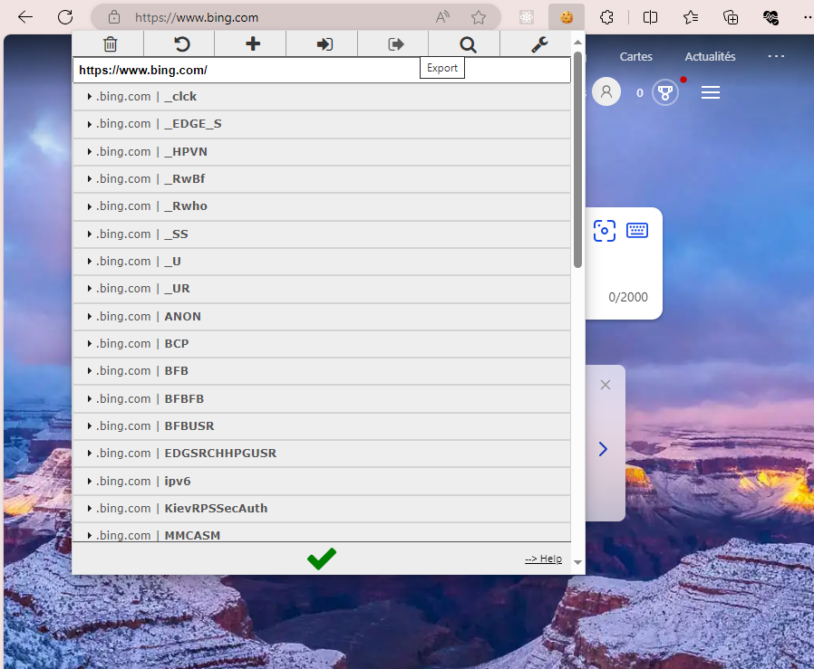

# fablocker-vocale-assistant

How to use:

1. Install Python on your machine, then  proceed with the requirements:

```bash
pip install -r requirements.txt
```

2. Install Cookie Editor extension in your browser.


3. Go to https://www.bing.com/ and copy the cookies with the extension.
   


4. Now, create a file named `cookies.json` and paste the cookies from the extension.